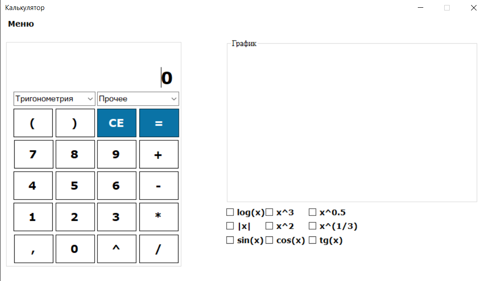

## Описание приложения

**Функциональность:**  
Приложение выполняет функции простейшего калькулятора:

- Арифметические операции:
  - сложение
  - вычитание
  - умножение
  - деление

- Научные функции:
  - тригонометрические функции (синус, косинус, тангенс и др.)
  - логарифм
  - возведение в степень

- Построение графика выбранной функции  
  - Возможность сохранения графика в файл формата `.png`

**Механизмы защиты:**

- Предотвращение повторного нажатия на кнопку десятичной запятой
- Защита от деления на ноль

## Основное окно программы

  

